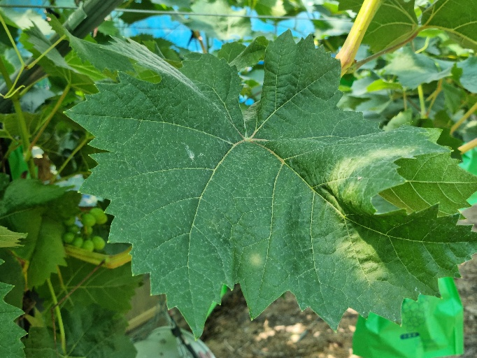
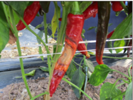
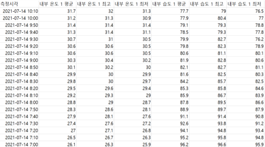
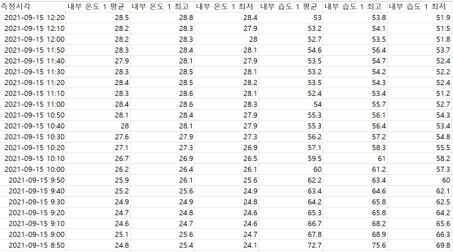
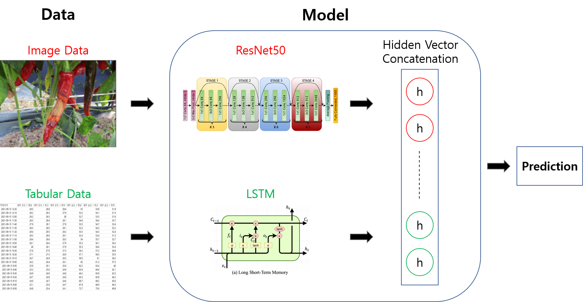

# LG_plant_disease_diagnosis_competition

Dacon, LG AI Research 주최 AI 경진대회 (Multimodal: CV + Tabluar)

주최 : LG AI Research, 주관: 데이콘
대회 페이지 링크: https://dacon.io/competitions/official/235870/overview/description

# 1. 배경

```
안녕하세요 여러분! 🙌 농업 환경 변화에 따른 작물 병해 진단 AI 경진대회에 오신 것을 환영합니다.

작물의 병해를 진단하고 병해 발생 원인을 찾는 것은 작물 재배에 있어 매우 중요한 일입니다. 

작물의 병해를 AI 가 정확하고 손쉽게 진단해 준다면 작물을 재배하는 모두에게 큰 도움이 될 것입니다.

병해 피해를 입은 작물 사진과 작물의 생장 환경 데이터를 이용해 작물의 병해를 진단하는 AI 모델을 개발해주세요!
```

## 목적

"작물 환경 데이터"와 "작물 병해 이미지"를 이용해 "작물의 종류", "병해의 종류", "병해의 진행 정도"를 진단하는 AI 모델 개발

# 2. 데이터 샘플

보다 자세한 설명은 [데이콘 대회 페이지](https://dacon.io/competitions/official/235870/overview/description)의 [데이터 설명](https://dacon.io/competitions/official/235870/data)을 참고

(실제 데이터는 저작권 문제로 업로드 X)

## 1) 작물 병해 이미지

<p align="center">
  
  
  <figcaption align="center"> <좌: 정상 작물, 우: 병해 작물 ></figcaption>
</p>

## 2) 작물 환경 데이터

<p align="center">
  
  
  <figcaption align="center"> <좌: 정상 작물, 우: 병해 작물 ></figcaption>
</p>

# 3. 모델 설명



## 1) 이미지 데이터 학습: ResNet50

작물 이미지 데이터 학습에는 `ResNet50` 모델을 사용.
- 비교적 가벼우면서도 일반적으로 좋은 성능을 보여주는 성능비 좋은 모델

## 2) 정형 데이터 학습: LSTM

작물 환경 데이터 학습에는 `LSTM` 모델을 사용.
- 환경 데이터가 시계열의 특성을 가지고 있기 때문

## 3) 앙상블: 단순 Concatenation

각 데이터를 학습한 결과(embedding vector)를 단순 Concatenation(=단순 선형 결합)하여 FC layer를 이용해 추론함

# 4. 사용법

## 1) Jupyter Notebook

1. `[Baseline]_ResNet50 + LSTM.ipynb` 파일을 순서대로 실행합니다.

## 2) CLI 환경

1. `config.yml` 파일의 하이퍼 파라미터를 원하는대로 바꾸고
2. 터미널에서 `main.py`가 위치한 폴더로 이동한 뒤 (`cd LG_plant_disease_diagnosis_competition`)
3. `python main.py` <- 명령어 실행


# 5. 주의 사항

1. 원 데이터 용량이 매우 크기 때문에 위 학습 코드를 정상적으로 실행하기 위해서는 약 20Gb의 RAM 용량이 필요합니다.
   - 만약 RAM 용량이 부족한 경우 `batch_size` 혹은 이미지 `resize` 크기를 조절하시기 바랍니다.
2. 위 코드는 작물 생장 환경 데이터에서 일부 feature만을 추출해서 사용했습니다. `data_prepare.py`의 내용을 수정하여 더 다양한 시도를 해볼 수 있습니다.